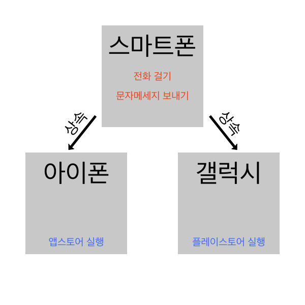

# 🚀 [Chapter01] 객체 지향 프로그래밍 Object Oriented Programming OOP

## 📍 0. 들어가기 전에

### 0.1 객체 지향 프로그래밍이란?

- 프로그램에 필요한 데이터를 추상화해 속성과 상태, 행위를 가진 객체를 만들고 그 객체간 상호작용을 바탕으로 로직을 구성하는 프로그래밍 기법.

> ### For Example
> 
> 아래와 같이 사람을 모델링 한다고 가정했을 경우 다음과 같이 속성/행위를 나누어 모델링 할 수 있다.
>
> - 속성 :
>   - 이름
>   - 성별
>   - ...
> - 행위 : 
>   - 컴퓨터를 켠다.
>   - 자바 프로젝트를 생성한다.
>   - 스프링 프로젝트를 생성한다.
>   - 저장.
>   - 컴퓨터를 종료한다.
>   - ...

#### 0.1.1 객체란?

위에서 사람을 모델링 했는데 모델링 된 사람은 실체가 없는 그저 '사람'이라는 개념에 지나지 않는다.  
위에서 정의된 사람이 탄생하고 그 이름이 부여되는 등 일련의 '생산'과정을 거치면 비로소 하나의 `객체`라고 볼 수 있다.

### 0.2 장점

- 모듈화 된 구조로 유지보수가 용이하다.
- 협업을 통한 대형 프로젝트 진행에 적합하다.
- 코드의 재사용이 용이하다.
- 객체의 모델링이 자연스럽다.

### 0.3 단점

- 객체 설계 시 객체에 대한 정확한 이해가 필요해 전체적인 개발 속도가 저하될 수 있다.
- 실행속도가 저하될 수 있다.
- 복잡한 상속관계로 인한 코딩 난이도가 높아질 수 있다.

## 🔍 1. 객체 지향 프로그래밍의 4가지 특징

### 1.1 캡슐화

예를 들어 사람이 알약을 입에 넣었을 때 알약 겉부분이 녹기 전까진 안에 든 내용물의 쓴 맛을 느낄 수 없는것 처럼 **관련있는 속성들을 한곳에 모아 관리, 보호하는 것**이다. `Java`에서는 다음과 같이 접근제한자를 통해 정보를 은닉/보호할 수 있다.

```
public class Human {

    // 'private' 접근제한자를 사용해 다른 클래스에서 멤버변수로의 접근을 제한한다.
    private String name;
    private String nationality;
    private int age;

    // 'public' 접근제한자로 모든 클래스에서 'move'메서드에 대한 접근을 허용한다.
    public void move() {
        ...
    }
    
    ...
}
```

> ### 🧐 정보은닉
> 
> 캡슐화 != 정보은닉  
> 캡슐화하면 불필요한 정보를 숨길 수 있어 정보은닉의 특성이 있다는 것이지 둘은 같은 개념이 아니다.

### 1.2 추상화

어떠한 존재가 가지는 여러 속성 중 **특정한 속성을 파악**하는 것.  
`스마트폰` 추상화 한다고 가정해보자.

```
속성 :
  - 제조사
  - 생산지
  - ...
행위 : 
  - 전화를 건다
  - 문자메세지를 보낸다.
  - ...
```

위 처럼 여러가지 속성을 정의 할 수 있다. 각 속성과 행위들은 다른 기종의 `휴대전화`와도 공유한다. 이 때 `휴대전화`이라는 상위 개념을 만들어 공통되는 행위와 속성들을 추출할 수 있는데 이를 추상화라 한다.  
아래 기술할 상속에서 좀 더 자세하게 다뤄보자.

### 1.3 상속

상속이란 기존의 클래스를 **재활용**해 새로운 클래스를 만들어내는 방법이다.  
위에서 `스마트폰`에 대해 추상화했는데 좀 더 세분화 시켜 보면 `아이폰`, `갤럭시` 등 제조사별로 세분화가 가능하다.

```
속성 : 
  - 기종 : 아이폰
  - 색상 : 스페이스그레이
  - ...
행위 : 
  - 밀어서 잠금 해제
  - ...
```

이 때 상위 개념과 겹치는 속성이나 행위를 다시 재정의 할 필요 없이 상위개념의 속성과 행위에 접근해 재사용 할 수 있게 하는것을 상속이라 한다.



### 1.4 다형성

**특정 속성이나 행위가 여러가지 형태를 가질 수 있는 성질**을 다형성이라 한다.  
비유적으로 어떤 사람이 있다고 볼 때 누군가의 애인, 자식, 부모가 될 수 있는것과 비슷하다.  
자바에서는 메서드 오버로딩, 오버라이딩으로 설명될 수 있다.

```
public class Main {

    public static void main(String[] args) {
        
        ...
        
        SmartPhone myPhone = new Iphone();
        SmartPhone yourPhone = new Galaxy();
        
        ...
    }

}

public class Iphone extends SmartPhone {
    
    ...
    
    @Override
    public void sendMessage() {
        System.out.println("imessage를 전송합니다.");
    }
    
    ...
}

public class Galaxy extends SmartPhone {
    
    ...
    
    @Override
    public void sendMessage() {
        System.out.println("메세지를 전송합니다.");
    }
    
    ...
}
```

## 👀 2. 객체지향 프로그래밍의 5원칙 SOLID

좋은 소프트웨어 설계를 위해 만들어진 원칙. 시스템상 예상치 못한 변경사항에 유연하게 대처가능하고 확장성을 확보한 시스템 구조를 만들 수 있고 생산성을 높이기 위해 고안됨.

> ### Q1. 5원칙 중 우선순위가 있나요?
> 
> A1. 없다. 한눈에 들어올 수 있게 정한 것이라 'SOLID' 라는 단어로 배열된것 뿐, 우선순위도, 순서도 없다.
> 
> ### Q2. 모든 프로젝트에 반드시 적용해야하나요?
> 
> A2. 반드시 적용할 필요는 없다. 다만 문제 대응에 용이성과 유지보수를 용이하게 하기 위함.

### 2.1 S : SRP 단일 책임 원칙 Single Responsibility Principle

- 클래스(객체)는 오직 하나의 책임(기능), 역할을 가져야 한다.
- 특정 기능에 대한 수정이 필요할 경우 변경이 일어나는 범위를 최소화해 코드의 유지보수성을 높이기 위함.

### 2.2 O : OCP 개방 폐쇄 원칙 Open-Closed Principle

- 클래스는 확장에는 열려있어야 하고 수정에는 닫혀있어야 한다.
  - 확장 : 새로운 요구사항이 있을 경우 새로운 코드를 추가해서 기능을 확장 할 수 있다.
  - 수정 : 기존 코드를 수정하지 않고 동작을 추가하거나 변경할 수 있다.

### 2.3 L : LSP 리스코프 치환 원칙 Liskov Substitution Principle

- 서브타입의 객체는 언제든 부모타입으로 바뀔 수 있어야 한다.
- 다형성 원리를 이용하기 위한 원칙.
- 상위 클래스 타입으로 선언하고 하위 클래스 인스턴스를 받았을 때 업캐스팅된 상태에서 상위 클래스 타입의 메서드를 실행 해도 의도대로 동작해야한다.

### 2.4 I : ISP 인터페이스 분리 원칙 Interface Segregation Principle

- 범용적인 인터페이스보다 **클라이언트가 실질적으로 사용하는 인터페이스 설계**를위한 원칙.
- 앞서 본 `SRP 단일 책임 원칙`이 클래스 단일 책임을 강조한다면 `ISP`는 인터페이스 단일 책임을 강조.
- 단, 인터페이스는 여러개의 역할을 수행함에 있어 클래스에 비해 자유롭다.
  - ex)
    ```
    public class SmartPhone implements WirelessChargeable, BiometricalAuthenticatable {
    
        void call() {
            ...
        }
        
        void message() {
            ...
        }
        
        @Override
        void wirelessCharge() {
            ...
        }
    
        @Override
        void biometricalAuthenticate() {
            ..,
        }
    } 
    ```

### 2.5 D : DIP 의존성 역전 원칙 Dependency Inversion Principle

- 특정 클래스를 참조해야 하는 상황이 오면 직접 참조하지 않고 상위 요소(인터페이스 or 부모클래스)를 참조하는 원칙.
- 클래스 간 결합도를 줄이는 것을 지향.
  - ex)
  - SmartPhone phone1 = new Iphone();
  - SmartPhone phone2 = new Galaxy();

---

### 📚 References

- [[OOP] 객체 지향 프로그래밍이란?](https://blog.itcode.dev/posts/2021/08/07/what-is-oop)
- [[OOP] 객체지향 프로그래밍의 5가지 설계 원칙, 실무 코드로 살펴보는 SOLID](https://mangkyu.tistory.com/194)
- [[OOP] 💠 객체 지향 개념과 추상화 - 완벽 이해하기](https://inpa.tistory.com/entry/OOP-%EA%B0%9D%EC%B2%B4-%EC%A7%80%ED%96%A5-%ED%94%84%EB%A1%9C%EA%B7%B8%EB%9E%98%EB%B0%8D-%EA%B0%9C%EB%85%90%EA%B3%BC-%EC%B6%94%EC%83%81%ED%99%94-%EC%84%A4%EA%B3%84%EC%9D%98-%EC%9D%B4%ED%95%B4)
