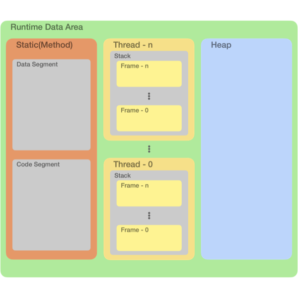

# 🚀 [Chapter02] JVM 메모리 구조

## 📍 0. 들어가기 전에

`JVM`의 런타임 영역은 크게 아래와 같이 나눌 수 있다.  
그림에 보여지는 영역외에 `PC Register`, `Native Method Stack` 등 다른 영역이 있지만 `메서드 영역`, `스택 영역`, `힙 영역`만 다뤄보겠다.



## 🔍 1. 각 영역별 특징

### 1.1 메서드 영역 Method Area

- 모든 스레드가 공유하는 영역.
- `정적 영역 Static Area`라고도 불리며 **클래스 변수와 메서드, 생성자 등**이 `메서드 영역` 내 `데이터 세그먼트`에 적재된다.
- 바이트 코드를 비롯한 모든 코드들은 `코드 세그먼트`에 적재된다.
- 메서드 영역은 프로그램의 시작 시점에 할당되고 프로그램 종료시점에 소멸한다.

### 1.2 스택 영역 Stack Area

- `PC Register`, `Native Method Stack`과 함께 **스레드 별로 생성**된다.
- 메서드 호출과 관계되는 영역.
- 메서드(함수)의 호출시점에 **스택 내 프레임을 생성**해 데이터가 할당되고 메서드 종료 시점에 할당 해제된다.
- `지역변수`와 `매개변수`가 저장되는 공간.
- 이름에서 알 수 있듯 **스택 구조**로 적재되는데 다른영역과 달리 **높은 주소에서 낮은 주소의 방향으로 적재**된다.

### 1.3 힙 영역 Heap Area

- 사용자에 의해 동적으로 할당되고 해제될 수 있는 공간.
- **모든 객체와 인스턴스 변수는 힙 영역에 생성**된다.
- 객체 생성 시점에 힙 영역에 적재된 데이터는 **미리 설정된 주기에 따라 GC를 통해 제거**된다.

## 🔍 2. 예제로 알아보기

다음 코드 중 각각의 요소는 JVM 메모리 영역 중 어디에 적재되는지 알아보자.

```
public class Main {

    public static void main(String[] args) {
        Circle circle = new Circle(3.0);
        circle.getArea();
    }
}

--

public class Circle {
    
    private double radius;
    private static final double PI = 3.141592;
    
    public Circle(double radius) {
        this.radius = radius;
    }
    
    public double getArea() {
        return this.radius * this.radius * PI;
    }
}
```

### 2.1 메서드 영역

#### 코드 세그먼트

- Main, Circle 클래스의 **바이트 코드**

#### 데이터 세그먼트

- public static void main(String[] args);
- private static final PI = 3.141592;
- public Circle(double radius);
- public double getArea();

### 2.2 스택 영역

- main() 프레임 내
  - Circle circle;

### 2.3 힙 영역

- new Circle(3.0);
- private double radius;

---

### 📚 References

- [자바 기초 강의 - 2-10강 자바 메모리 구조의 이해](https://www.youtube.com/watch?v=QPulWilGBpk)
- [자바 메모리 구조 뿌시기 [ JVM이란? ]](https://www.youtube.com/watch?v=AWXPnMDZ9I0)
- [[Java] 자바 JVM 내부 구조와 메모리 구조에 대하여](https://coding-factory.tistory.com/828)
- [[JAVA] 자바의 변수 (클래스 변수, 인스턴스 변수, 지역 변수)](https://itmining.tistory.com/20)
